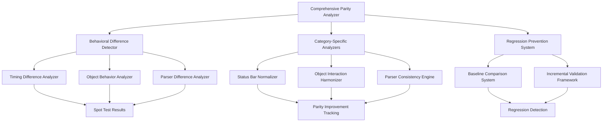

# Design Document

## Overview

This design document outlines a systematic approach to achieving comprehensive parity analysis and resolution of behavioral differences between the TypeScript Zork I implementation and the original Z-Machine game. The goal is to improve from the current 76.5% parity to 95%+ through methodical analysis and targeted fixes.

**Current State Analysis:**
- 76.5% parity (47 differences out of 200 commands)
- Timing differences: 32 occurrences (68% of issues)
- Object behavior differences: 13 occurrences (28% of issues)  
- Parser differences: 2 occurrences (4% of issues)

**Design Philosophy:**
1. **Regression Prevention First:** Never decrease from 76.5% baseline
2. **Systematic Categorization:** Address issues by type, not randomly
3. **Incremental Validation:** Test each fix before proceeding
4. **Root Cause Focus:** Fix underlying causes, not symptoms

## Architecture

### Core Components



### System Integration

The comprehensive parity analysis system integrates with existing components:

1. **Spot Testing Framework:** Enhanced to provide detailed categorization
2. **Quick Validator:** Extended with category-specific analysis
3. **Status Display Manager:** Modified for exact Z-Machine compatibility
4. **Parser Error Handler:** Aligned with Z-Machine error patterns
5. **Object Interaction System:** Harmonized with original behavior

## Components and Interfaces

### 1. Comprehensive Parity Analyzer

**Purpose:** Orchestrates the entire parity analysis and improvement process

**Interface:**
```typescript
interface ComprehensiveParity Analyzer {
  analyzeCurrentState(): ParityAnalysisResult;
  categorizeIssues(differences: CommandDifference[]): CategorizedIssues;
  prioritizeResolution(issues: CategorizedIssues): ResolutionPlan;
  validateImprovement(baseline: ParityResult, current: ParityResult): ValidationResult;
}
```

**Key Methods:**
- `analyzeCurrentState()`: Performs comprehensive analysis of current parity state
- `categorizeIssues()`: Groups differences by type (timing, object behavior, parser)
- `prioritizeResolution()`: Creates systematic plan for addressing issues
- `validateImprovement()`: Ensures no regression from baseline

### 2. Behavioral Difference Detector

**Purpose:** Identifies and classifies specific types of behavioral differences

**Interface:**
```typescript
interface BehavioralDifferenceDetector {
  detectTimingDifferences(tsOutput: string, zmOutput: string): TimingDifference[];
  detectObjectBehaviorDifferences(tsOutput: string, zmOutput: string): ObjectBehaviorDifference[];
  detectParserDifferences(tsOutput: string, zmOutput: string): ParserDifference[];
  classifyDifference(difference: CommandDifference): DifferenceCategory;
}
```

**Classification Logic:**
- **Timing Differences:** Status bar contamination, move counter sync, daemon timing
- **Object Behavior:** Error message patterns, interaction handling, state management
- **Parser Differences:** Vocabulary recognition, command syntax, error responses

### 3. Category-Specific Analyzers

#### Status Bar Normalizer
**Purpose:** Ensures TypeScript status bar output matches Z-Machine exactly

**Key Features:**
- Remove status bar contamination from game responses
- Synchronize move counters precisely
- Format status information identically to Z-Machine

#### Object Interaction Harmonizer  
**Purpose:** Aligns object interaction behavior with Z-Machine patterns

**Key Features:**
- Standardize "drop" command error messages
- Align object visibility error patterns
- Synchronize container interaction handling
- Match inventory state management

#### Parser Consistency Engine
**Purpose:** Ensures command parsing matches Z-Machine exactly

**Key Features:**
- Vocabulary alignment (remove "room" if not in Z-Machine)
- Error message consistency
- Command recognition patterns
- Syntax validation alignment

### 4. Regression Prevention System

**Purpose:** Prevents any decrease in parity during improvement process

**Interface:**
```typescript
interface RegressionPreventionSystem {
  establishBaseline(): ParityBaseline;
  validateChange(baseline: ParityBaseline, current: ParityResult): RegressionCheck;
  rollbackIfRegression(change: CodeChange): boolean;
  trackProgress(improvements: ParityImprovement[]): ProgressReport;
}
```

**Safety Mechanisms:**
- Baseline establishment before any changes
- Automatic rollback if parity decreases
- Incremental validation after each fix
- Progress tracking with regression alerts

## Data Models

### Parity Analysis Result
```typescript
interface ParityAnalysisResult {
  currentParity: number;
  totalDifferences: number;
  categorizedIssues: CategorizedIssues;
  prioritizedPlan: ResolutionPlan;
  baseline: ParityBaseline;
}
```

### Categorized Issues
```typescript
interface CategorizedIssues {
  timingDifferences: TimingDifference[];
  objectBehaviorDifferences: ObjectBehaviorDifference[];
  parserDifferences: ParserDifference[];
  summary: CategorySummary;
}
```

### Resolution Plan
```typescript
interface ResolutionPlan {
  phases: ResolutionPhase[];
  targetParity: number;
  estimatedEffort: EffortEstimate;
  riskAssessment: RiskAssessment;
}
```

### Regression Check
```typescript
interface RegressionCheck {
  hasRegression: boolean;
  parityChange: number;
  newIssues: CommandDifference[];
  resolvedIssues: CommandDifference[];
  recommendation: RegressionRecommendation;
}
```

## Implementation Notes

### File Writing Best Practices
When implementing tasks in this spec, always use Kiro's file tools (`fsWrite`, `fsAppend`, `strReplace`) instead of bash heredocs for creating or modifying files. Heredocs (`cat << 'EOF'`) can crash the PTY host when writing large files (100+ lines) due to terminal buffer overflow. See `.kiro/steering/agent-practices.md` for full guidelines.

## Error Handling

### Regression Detection
- **Immediate Detection:** Compare parity after each change
- **Automatic Rollback:** Revert changes that decrease parity
- **Alert System:** Notify when regression is detected
- **Recovery Process:** Systematic approach to fix regressions

### Validation Failures
- **Test Framework Issues:** Detect and handle testing framework problems
- **Environment Differences:** Account for system-specific variations
- **Timing Sensitivity:** Handle non-deterministic behavior appropriately
- **Resource Constraints:** Manage memory and performance limitations

### Category-Specific Error Handling
- **Timing Errors:** Handle daemon synchronization issues
- **Object Errors:** Manage state consistency problems
- **Parser Errors:** Address vocabulary and syntax discrepancies

## Testing Strategy

### Dual Testing Approach
The system uses both unit tests and property-based tests for comprehensive validation:

**Unit Tests:**
- Specific behavioral difference scenarios
- Category-specific analyzer functionality
- Regression prevention mechanisms
- Edge cases and error conditions

**Property-Based Tests:**
- Universal properties across all command types
- Parity consistency across multiple seeds
- Regression prevention across all categories
- Systematic improvement validation

### Property-Based Testing Configuration
- **Library:** fast-check for TypeScript
- **Iterations:** Minimum 100 per property test
- **Seeding:** Deterministic seeds for reproducible results
- **Coverage:** All major behavioral categories

### Test Categories

#### Regression Prevention Tests
- Baseline comparison validation
- Incremental improvement verification
- Rollback mechanism testing
- Progress tracking accuracy

#### Category-Specific Tests
- Timing difference resolution validation
- Object behavior alignment verification
- Parser consistency confirmation
- Cross-category interaction testing

#### Integration Tests
- End-to-end parity improvement workflows
- Multi-seed validation consistency
- Performance impact assessment
- System reliability under load

## Correctness Properties

*A property is a characteristic or behavior that should hold true across all valid executions of a system—essentially, a formal statement about what the system should do. Properties serve as the bridge between human-readable specifications and machine-verifiable correctness guarantees.*

### Property 1: Behavioral Difference Categorization
*For any* set of behavioral differences detected during parity analysis, the system should correctly categorize each difference by type (timing, object behavior, parser) and prioritize them by impact and frequency.
**Validates: Requirements 1.1, 5.2, 6.1**

### Property 2: Timing Difference Classification
*For any* timing-related difference detected, the system should correctly identify whether it represents status bar contamination or a legitimate behavioral difference.
**Validates: Requirements 1.2**

### Property 3: Status Bar Formatting Consistency
*For any* game state, when status bar information is displayed, the TypeScript engine should produce formatting identical to the Z-Machine implementation.
**Validates: Requirements 2.1, 2.5**

### Property 4: Daemon Message Synchronization
*For any* daemon-triggered event, the TypeScript engine should produce messages with identical timing and content to the Z-Machine implementation.
**Validates: Requirements 2.2**

### Property 5: Atmospheric Message Determinism
*For any* given seed, atmospheric message randomization should produce identical results between TypeScript and Z-Machine implementations.
**Validates: Requirements 2.3**

### Property 6: Response Contamination Elimination
*For any* game response, the output should not contain status bar contamination or extraneous formatting information.
**Validates: Requirements 2.4**

### Property 7: Error Message Consistency
*For any* error condition (unknown words, invalid syntax, object visibility, drop without object), the TypeScript engine should produce error messages identical to the Z-Machine implementation.
**Validates: Requirements 3.1, 3.2, 4.1, 4.3**

### Property 8: Object Interaction Parity
*For any* object interaction (container operations, inventory management, manipulation), the TypeScript engine should maintain identical state and behavior to the Z-Machine implementation.
**Validates: Requirements 3.3, 3.4**

### Property 9: Vocabulary Recognition Consistency
*For any* word or command, the TypeScript engine should recognize exactly the same vocabulary as the Z-Machine implementation.
**Validates: Requirements 4.2**

### Property 10: Ambiguity Resolution Alignment
*For any* ambiguous command, the TypeScript engine should resolve ambiguity identically to the Z-Machine implementation.
**Validates: Requirements 4.5**

### Property 11: Edge Case Handling Uniformity
*For any* edge case scenario (object manipulation, parser handling), the TypeScript engine should handle it identically to the Z-Machine implementation.
**Validates: Requirements 3.5, 4.4**

### Property 12: Parity Measurement Accuracy
*For any* spot testing session, the system should provide accurate parity measurements without false positives or negatives.
**Validates: Requirements 5.1**

### Property 13: Comprehensive Validation Coverage
*For any* implemented fix, the system should validate that no regressions occur and that improvements are sustained across multiple command sequences.
**Validates: Requirements 5.3, 6.3**

### Property 14: Root Cause Analysis Completeness
*For any* detected behavioral difference, the system should provide detailed analysis with accurate root cause identification.
**Validates: Requirements 1.3, 1.4, 5.4**

### Property 15: Progress Tracking Accuracy
*For any* parity improvement made, the system should accurately track progress toward the 95%+ target and maintain detailed historical records.
**Validates: Requirements 5.5, 6.4**

### Property 16: Systematic Fix Implementation
*For any* fix implementation process, the system should follow a systematic approach that avoids introducing new issues while maintaining regression prevention.
**Validates: Requirements 6.2**

### Property 17: Achievement Validation Completeness
*For any* claimed parity achievement of 95%+, the system should provide comprehensive validation across multiple seeds and command sequences.
**Validates: Requirements 6.5**

### Property 18: Analysis Report Completeness
*For any* category of behavioral differences, the system should provide detailed analysis reports containing all necessary information for resolution.
**Validates: Requirements 1.5**