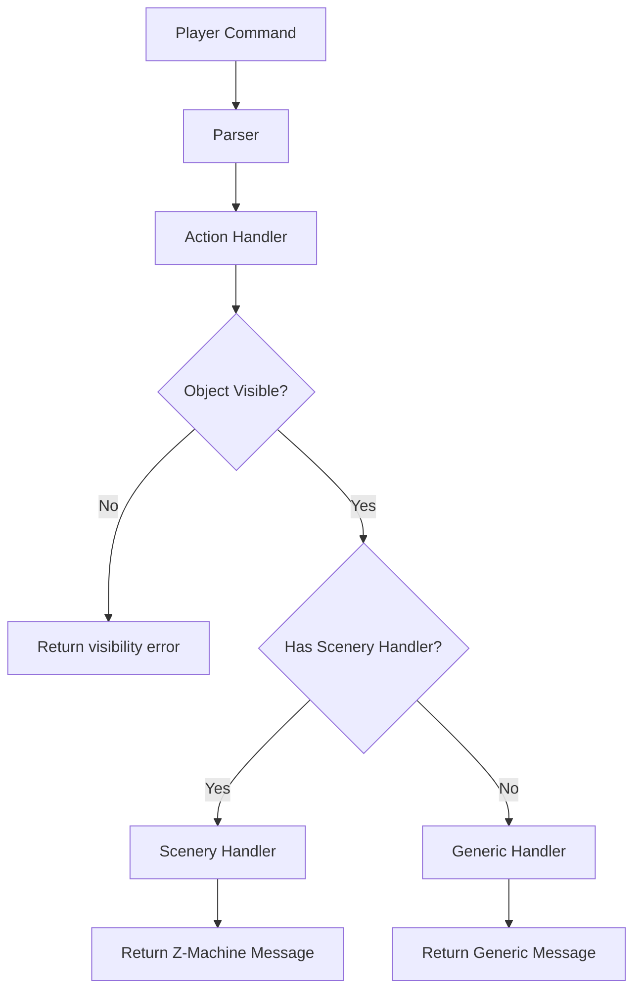

# Design Document: Parity Final Push

## Overview

This design document outlines the targeted approach to achieving 99%+ behavioral parity between the TypeScript Zork I implementation and the original Z-Machine implementation. The current parity is ~70% with 46-61 differences per 200 commands. Analysis shows the remaining differences fall into specific categories that can be addressed with targeted fixes.

The key insight from previous work is that the parity modules (ErrorMessageStandardizer, ObjectInteractionHarmonizer) exist but aren't being used by the actual scenery handlers in `sceneryActions.ts`. The fix requires updating the scenery handlers to return Z-Machine-exact messages.

## Architecture

The fix strategy follows a simple pattern: update the scenery handlers to return exact Z-Machine messages.



## Components and Interfaces

### 1. Updated Scenery Handlers

**Location:** `src/game/sceneryActions.ts`

**Changes Required:**

The existing scenery handlers need message updates to match Z-Machine exactly:

```typescript
// WHITE-HOUSE handler updates
const whiteHouseHandler: SceneryHandler = {
  objectId: 'WHITE-HOUSE',
  actions: new Map([
    ['OPEN', () => "I can't see how to get in from here."],  // Was missing
    ['TAKE', () => "What a concept!"],  // Was "You can't take that!"
    ['PUSH', () => "You can't move the white house."],  // New
    ['PULL', () => "You can't move the white house."],  // New
    // ... existing handlers
  ])
};

// FOREST handler updates
const forestHandler: SceneryHandler = {
  objectId: 'FOREST',
  actions: new Map([
    ['TAKE', () => "What a concept!"],  // Was "You can't be serious."
    ['PUSH', () => "Pushing the forest has no effect."],  // New
    ['PULL', () => "You can't move the forest."],  // New
    ['CLOSE', () => "You must tell me how to do that to a forest."],  // New
    // ... existing handlers
  ])
};

// BOARD handler updates
const boardHandler: SceneryHandler = {
  objectId: 'BOARD',
  actions: new Map([
    ['PULL', () => "You can't move the board."],  // New
    ['PUSH', () => "You can't move the board."],  // New
    // ... existing handlers
  ])
};
```

### 2. Boarded Window Visibility Fix

**Location:** `src/game/data/objects.ts` or room definitions

**Issue:** The boarded window is incorrectly visible from WEST-OF-HOUSE.

**Fix:** Remove BOARDED-WINDOW from globalObjects or add room-specific visibility check.

```typescript
// In the visibility check, add room-specific rules
function isObjectVisibleInRoom(objectId: string, roomId: string): boolean {
  // Special case: boarded window is NOT visible from WEST-OF-HOUSE
  if (objectId === 'BOARDED-WINDOW' && roomId === 'WEST-OF-HOUSE') {
    return false;
  }
  // ... rest of visibility logic
}
```

### 3. Greeting Response Alignment

**Location:** `src/game/data/messages.ts`

**Current:** Returns a single greeting or random selection that doesn't match Z-Machine.

**Fix:** Use seeded random to match Z-Machine's greeting selection.

```typescript
const GREETINGS = [
  "Hello.",
  "Good day.",
  "Nice weather we've been having lately."
];

export function getHelloMessage(state: GameState): string {
  // Use game's random seed for deterministic selection
  const index = state.getRandomInt(0, GREETINGS.length);
  return GREETINGS[index];
}
```

### 4. Parser Verb-Type Error Messages

**Location:** `src/parser/parser.ts` or `src/game/actions.ts`

**Issue:** Some verbs return generic errors instead of verb-type-specific errors.

**Fix:** Add verb-type-specific error handling for scenery objects.

```typescript
// For CLOSE on scenery objects
if (verb === 'CLOSE' && isSceneryObject(objectId)) {
  return `You must tell me how to do that to a ${objectName}.`;
}
```

## Data Models

### SceneryErrorMapping (Enhanced)

```typescript
interface SceneryErrorMapping {
  objectId: string;
  verb: string;
  message: string;
  roomRestriction?: string[];  // Only apply in these rooms
}

// Centralized registry of all object/verb/message mappings
const SCENERY_ERROR_REGISTRY: SceneryErrorMapping[] = [
  // White House
  { objectId: 'WHITE-HOUSE', verb: 'OPEN', message: "I can't see how to get in from here." },
  { objectId: 'WHITE-HOUSE', verb: 'TAKE', message: "What a concept!" },
  { objectId: 'WHITE-HOUSE', verb: 'PUSH', message: "You can't move the white house." },
  { objectId: 'WHITE-HOUSE', verb: 'PULL', message: "You can't move the white house." },
  
  // Forest
  { objectId: 'FOREST', verb: 'TAKE', message: "What a concept!" },
  { objectId: 'FOREST', verb: 'PUSH', message: "Pushing the forest has no effect." },
  { objectId: 'FOREST', verb: 'PULL', message: "You can't move the forest." },
  { objectId: 'FOREST', verb: 'CLOSE', message: "You must tell me how to do that to a forest." },
  
  // Board
  { objectId: 'BOARD', verb: 'PULL', message: "You can't move the board." },
  { objectId: 'BOARD', verb: 'PUSH', message: "You can't move the board." },
  
  // Boarded Window
  { objectId: 'BOARDED-WINDOW', verb: 'TAKE', message: "You can't be serious." },
];
```

### VisibilityRule

```typescript
interface VisibilityRule {
  objectId: string;
  visibleInRooms?: string[];    // Only visible in these rooms
  notVisibleInRooms?: string[]; // Not visible in these rooms
}

const VISIBILITY_RULES: VisibilityRule[] = [
  { objectId: 'BOARDED-WINDOW', notVisibleInRooms: ['WEST-OF-HOUSE'] },
];
```

## Correctness Properties

*A property is a characteristic or behavior that should hold true across all valid executions of a system—essentially, a formal statement about what the system should do. Properties serve as the bridge between human-readable specifications and machine-verifiable correctness guarantees.*

### Property 1: White House Handler Messages

*For any* verb in {OPEN, TAKE, PUSH, PULL}, when applied to WHITE-HOUSE, the handler SHALL return the exact Z-Machine message for that verb.

**Validates: Requirements 1.1, 1.2, 1.3, 1.4**

### Property 2: Forest Handler Messages

*For any* verb in {TAKE, PUSH, PULL, CLOSE}, when applied to FOREST, the handler SHALL return the exact Z-Machine message for that verb.

**Validates: Requirements 2.1, 2.2, 2.3, 2.4**

### Property 3: Board Handler Messages

*For any* verb in {PULL, PUSH}, when applied to BOARD, the handler SHALL return the exact Z-Machine message for that verb.

**Validates: Requirements 3.1, 3.2**

### Property 4: Boarded Window Visibility

*For any* room, the BOARDED-WINDOW visibility SHALL match Z-Machine visibility rules. Specifically, BOARDED-WINDOW SHALL NOT be visible from WEST-OF-HOUSE.

**Validates: Requirements 4.1, 4.2**

### Property 5: Greeting Determinism

*For any* fixed random seed, the HELLO command SHALL return the same greeting across multiple runs, and the greeting SHALL be one of: "Hello.", "Good day.", "Nice weather we've been having lately."

**Validates: Requirements 5.1, 5.2**

### Property 6: Visibility Error Priority

*For any* object that is not visible in the current room, the action handler SHALL return "You can't see any [object] here!" BEFORE checking scenery handlers or other error conditions.

**Validates: Requirements 8.1, 8.2, 8.3**

## Error Handling

### Visibility Errors

1. Check visibility FIRST before any other processing
2. Return "You can't see any [object] here!" for non-visible objects
3. Apply room-specific visibility rules for globalObjects

### Scenery Errors

1. Check scenery handler registry for exact message
2. Fall back to generic message only if no specific handler exists
3. Use verb-type-specific format for applicable verbs

## Testing Strategy

### Unit Tests

Unit tests verify specific examples and edge cases:

1. **White House Messages**: Test each verb returns exact Z-Machine message
2. **Forest Messages**: Test each verb returns exact Z-Machine message
3. **Board Messages**: Test PULL and PUSH return exact messages
4. **Boarded Window Visibility**: Test visibility from each room
5. **Greeting Selection**: Test all three greetings are possible

### Property-Based Tests

Property tests verify universal properties across many generated inputs using fast-check:

1. **Object Handler Messages**: Generate random object/verb pairs and verify messages match registry
2. **Visibility Priority**: Generate random non-visible objects and verify visibility error is returned first
3. **Greeting Determinism**: Generate random seeds and verify same seed produces same greeting

### Integration Tests

1. **Multi-Seed Parity Validation**: Run spot tests with all 5 seeds
2. **Regression Detection**: Compare before/after parity for changes

### Test Configuration

- Property tests: Minimum 100 iterations per property
- Parity tests: 200 commands per seed, 5 seeds
- Pass threshold: 99% parity (≤2 differences per 200 commands)

