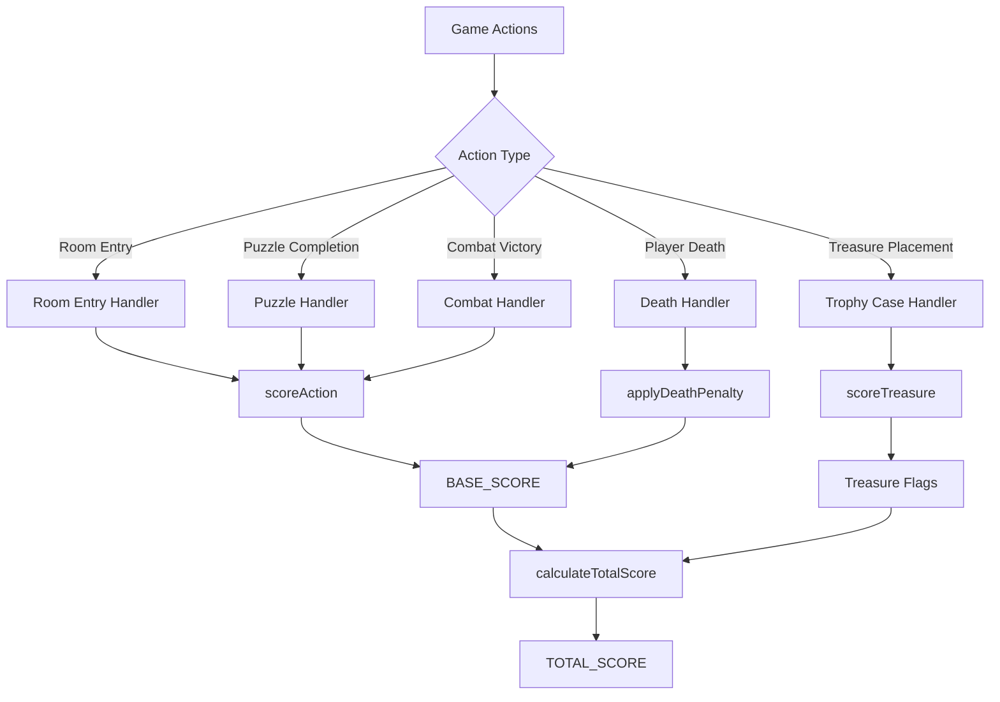

# Design Document: Scoring System Fix

## Overview

This design document describes the implementation of a complete and accurate scoring system for the TypeScript Zork I implementation. The current system only handles treasure scoring with incorrect values. This design adds:

1. Corrected treasure values (TVALUE) matching the original ZIL
2. Action points (VALUE) for puzzles, combat, and room entry
3. Death penalty (-10 points)
4. Proper score calculation (BASE_SCORE + treasure points)
5. Win condition detection

## Architecture

The scoring system follows the original ZIL architecture with two score components:

```
TOTAL_SCORE = BASE_SCORE + OTVAL_FROB(TROPHY_CASE)
```

Where:
- `BASE_SCORE`: Accumulated action points (room entry, puzzle completion, combat)
- `OTVAL_FROB`: Sum of TVALUE for all treasures currently in the trophy case



## Components and Interfaces

### 1. Scoring Module (`src/game/scoring.ts`)

#### Updated Constants

```typescript
/**
 * Treasure values (TVALUE) - points when in trophy case
 * Corrected to match original ZIL 1dungeon.zil
 */
export const TREASURE_VALUES: Record<string, number> = {
  'SKULL': 10,
  'CHALICE': 5,        // Was 5, correct
  'TRIDENT': 11,
  'DIAMOND': 10,
  'JADE': 5,
  'EMERALD': 10,       // Was 5, corrected to 10
  'BAG-OF-COINS': 5,   // Was 10, corrected to 5
  'PAINTING': 6,       // Was 4, corrected to 6
  'SCEPTRE': 6,        // Was 4, corrected to 6
  'COFFIN': 15,        // Was 10, corrected to 15
  'TORCH': 6,          // Was 5, corrected to 6
  'BRACELET': 5,
  'SCARAB': 5,
  'BAR': 5,
  'POT-OF-GOLD': 10,
  'TRUNK': 5,          // Was 15, corrected to 5
  'EGG': 5,
  'CANARY': 4,
  'BAUBLE': 1,
  'BROKEN-EGG': 2,     // Added
  'BROKEN-CANARY': 1   // Added
};

/**
 * Action point values (VALUE) - points for completing actions
 * From ZIL VALUE property on objects and rooms
 */
export const ACTION_VALUES: Record<string, number> = {
  // Room entry points
  'ENTER_KITCHEN': 10,      // Living room / Kitchen
  'ENTER_CELLAR': 25,
  'ENTER_TREASURE_ROOM': 25,
  'ENTER_HADES': 4,
  'ENTER_LOWER_SHAFT_LIT': 5, // LIGHT-SHAFT variable
  
  // Combat victories
  'DEFEAT_TROLL': 10,
  'DEFEAT_THIEF': 25,
  'DEFEAT_CYCLOPS': 10,
  
  // Puzzle completions
  'OPEN_EGG': 5,            // VALUE on EGG
  'INFLATE_BOAT': 5,
  'RAISE_DAM': 3,
  'LOWER_DAM': 3,
  'PUT_COAL_IN_MACHINE': 5,
  'TURN_ON_MACHINE': 1,
  'WAVE_SCEPTRE': 5,
  'COMPLETE_EXORCISM': 4,
  
  // Death penalty
  'DEATH_PENALTY': -10
};

export const MAX_SCORE = 350;
```

#### New Functions

```typescript
/**
 * Award action points (one-time only)
 * Tracks which actions have been scored to prevent double-scoring
 */
export function scoreAction(state: GameState, actionId: string): number {
  const value = ACTION_VALUES[actionId];
  if (!value) return 0;
  
  // Check if already scored
  const scoredActions = state.getGlobalVariable('SCORED_ACTIONS') || new Set<string>();
  if (scoredActions.has(actionId)) return 0;
  
  // Mark as scored and award points
  scoredActions.add(actionId);
  state.setGlobalVariable('SCORED_ACTIONS', scoredActions);
  state.addToBaseScore(value);
  
  return value;
}

/**
 * Apply death penalty
 */
export function applyDeathPenalty(state: GameState): void {
  const penalty = Math.abs(ACTION_VALUES['DEATH_PENALTY']);
  const currentScore = state.getBaseScore();
  const newScore = Math.max(0, currentScore - penalty);
  state.setBaseScore(newScore);
}

/**
 * Calculate total score (BASE_SCORE + treasure points)
 * This matches the ZIL OTVAL-FROB calculation
 */
export function calculateTotalScore(state: GameState): number {
  const baseScore = state.getBaseScore();
  const treasureScore = calculateTreasureScore(state);
  return baseScore + treasureScore;
}

/**
 * Calculate sum of TVALUE for treasures in trophy case
 */
export function calculateTreasureScore(state: GameState): number {
  let total = 0;
  for (const [objectId, value] of Object.entries(TREASURE_VALUES)) {
    const obj = state.getObject(objectId);
    if (obj && obj.location === TROPHY_CASE_ID) {
      total += value;
    }
  }
  return total;
}

/**
 * Check for win condition and trigger message
 */
export function checkWinCondition(state: GameState): string | null {
  const totalScore = calculateTotalScore(state);
  if (totalScore >= MAX_SCORE && !state.getFlag('WON_FLAG')) {
    state.setFlag('WON_FLAG', true);
    return "Your score has just reached 350 points! Congratulations, you have achieved the rank of Master Adventurer!";
  }
  return null;
}
```

### 2. Game State Updates (`src/game/state.ts`)

Add support for BASE_SCORE tracking:

```typescript
export class GameState {
  // ... existing properties ...
  private baseScore: number = 0;
  
  getBaseScore(): number {
    return this.baseScore;
  }
  
  setBaseScore(value: number): void {
    this.baseScore = value;
  }
  
  addToBaseScore(points: number): void {
    this.baseScore += points;
  }
  
  // Update score getter to use calculateTotalScore
  get score(): number {
    return calculateTotalScore(this);
  }
}
```

### 3. Integration Points

#### Room Entry Scoring

In `MoveAction.execute()`, after successful room change:

```typescript
// Check for room entry scoring
if (exit.destination === 'KITCHEN' || exit.destination === 'LIVING-ROOM') {
  const points = scoreAction(state, 'ENTER_KITCHEN');
  if (points > 0) {
    // First time entering - points awarded
  }
}
// Similar for CELLAR, TREASURE-ROOM, HADES, LOWER-SHAFT
```

#### Combat Victory Scoring

In combat resolution handlers:

```typescript
// When troll is defeated
scoreAction(state, 'DEFEAT_TROLL');

// When thief is defeated
scoreAction(state, 'DEFEAT_THIEF');

// When cyclops flees
scoreAction(state, 'DEFEAT_CYCLOPS');
```

#### Puzzle Completion Scoring

In respective puzzle handlers:

```typescript
// DamPuzzle.raiseDam()
scoreAction(state, 'RAISE_DAM');

// DamPuzzle.lowerDam()
scoreAction(state, 'LOWER_DAM');

// RainbowPuzzle.waveSceptre()
scoreAction(state, 'WAVE_SCEPTRE');

// BellPuzzle.completeExorcism()
scoreAction(state, 'COMPLETE_EXORCISM');

// MachinePuzzle.putCoal()
scoreAction(state, 'PUT_COAL_IN_MACHINE');

// MachinePuzzle.turnOn()
scoreAction(state, 'TURN_ON_MACHINE');

// BoatPuzzle.inflate()
scoreAction(state, 'INFLATE_BOAT');

// EggPuzzle.openEgg()
scoreAction(state, 'OPEN_EGG');
```

#### Death Penalty

In `death.ts`:

```typescript
export function handlePlayerDeath(state: GameState): void {
  applyDeathPenalty(state);
  // ... existing death handling ...
}
```

## Data Models

### Scored Actions Tracking

```typescript
interface ScoringState {
  baseScore: number;
  scoredActions: Set<string>;
  wonFlag: boolean;
}
```

### Serialization Format

For save/restore, the scoring state must be serialized:

```typescript
interface SerializedScoringState {
  baseScore: number;
  scoredActions: string[];  // Set converted to array
  wonFlag: boolean;
}
```

## Correctness Properties

*A property is a characteristic or behavior that should hold true across all valid executions of a system-essentially, a formal statement about what the system should do. Properties serve as the bridge between human-readable specifications and machine-verifiable correctness guarantees.*

### Property 1: Treasure Scoring Idempotence

*For any* treasure and any sequence of put/take operations on the trophy case, the treasure's contribution to the score should be exactly its TVALUE when in the case and 0 when not in the case, regardless of how many times it has been placed or removed.

**Validates: Requirements 1.2, 1.3**

### Property 2: Rank Calculation Correctness

*For any* score value from 0 to 350, the getRank function should return the correct rank according to the defined thresholds: Beginner (0-25), Amateur Adventurer (26-50), Novice Adventurer (51-100), Junior Adventurer (101-200), Adventurer (201-300), Master (301-330), Wizard (331-349), Master Adventurer (350).

**Validates: Requirements 4.3**

### Property 3: Death Penalty Application

*For any* game state with a positive score, applying the death penalty should reduce the score by exactly 10 points, and for scores less than 10, the result should be 0 (never negative).

**Validates: Requirements 3.1, 3.2**

### Property 4: Save/Restore Round-Trip

*For any* game state with scored actions and treasures, saving and then restoring should produce an equivalent scoring state where the same actions cannot be re-scored and the total score is identical.

**Validates: Requirements 5.1, 5.2, 5.3**

### Property 5: Action Scoring Idempotence

*For any* action that awards points, triggering that action multiple times should only award points once, and the BASE_SCORE should reflect exactly the sum of unique action values.

**Validates: Requirements 7.1, 7.2, 7.3**

### Property 6: Max Score Invariant

*For any* sequence of game actions (scoring treasures, completing puzzles, dying), the total score should never exceed 350 points.

**Validates: Requirements 7.4**

## Error Handling

### Invalid Object IDs

When `scoreTreasure` or `scoreAction` is called with an invalid ID:
- Return 0 points
- Do not modify game state
- Log warning in debug mode

### Score Overflow Protection

The scoring system should clamp the total score:
- Minimum: 0 (after death penalties)
- Maximum: 350 (game maximum)

### Missing State

If scoring state is missing during restore:
- Initialize with default values (baseScore: 0, scoredActions: empty)
- Log warning

## Testing Strategy

### Unit Tests

1. **Treasure value verification**: Test each treasure ID returns correct TVALUE
2. **Action value verification**: Test each action ID returns correct VALUE
3. **Rank thresholds**: Test boundary values for each rank
4. **Death penalty edge cases**: Test with scores 0, 5, 10, 15
5. **Win condition trigger**: Test score reaching 350

### Property-Based Tests

Using Vitest with fast-check:

1. **Treasure idempotence**: Generate random sequences of put/take operations
2. **Rank correctness**: Generate random scores and verify rank
3. **Death penalty**: Generate random scores and verify penalty application
4. **Save/restore**: Generate random game states and verify round-trip
5. **Action idempotence**: Generate random action sequences
6. **Max score invariant**: Generate random action sequences and verify bound

Configuration:
- Minimum 100 iterations per property test
- Tag format: `Feature: scoring-system-fix, Property N: description`
